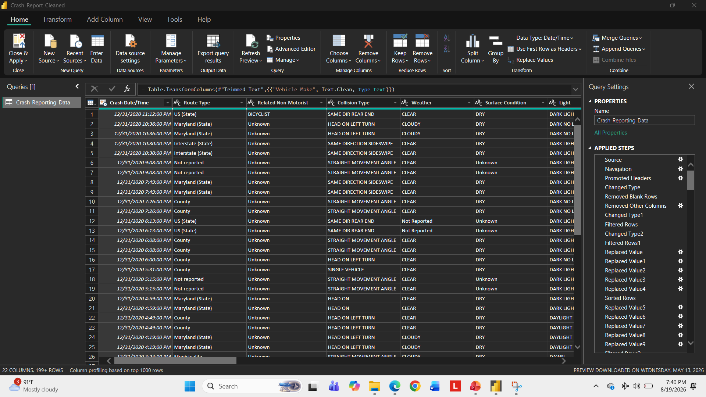
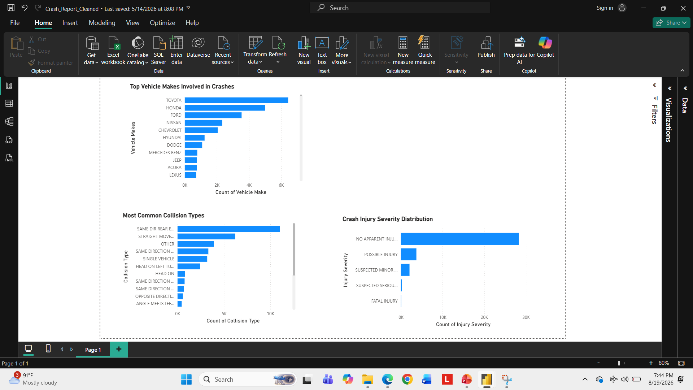

# Crash Data Analysis | Power BI

## Project Overview

This project analyzes crash-reporting data using Microsoft Power BI. The goal was to transform raw crash data into a clean, structured dataset and develop an interactive dashboard that makes patterns and trends easier to identify.

The project demonstrates the complete data-analysis workflow from data preparation and transformation to visualization and presentation.

## Dataset

The dataset contains crash-reporting records with information such as:

- Crash date and time
- Route type
- Collision type
- Weather conditions
- Surface conditions
- Lighting conditions
- Vehicle and roadway information

## Data Cleaning & Transformation

Power Query was used to prepare the dataset for analysis.

Key transformation steps included:

- Removing unnecessary columns
- Removing blank rows
- Correcting data types
- Filtering records
- Replacing inconsistent and missing values
- Cleaning text values
- Standardizing categorical data
- Preparing fields for analysis and visualization

## Power BI Dashboard

After cleaning the data, I developed a Power BI dashboard to analyze crash patterns and make the information easier to interpret.

The dashboard includes visualizations examining crash characteristics and contributing factors within the dataset.

## Tools Used

- Microsoft Power BI
- Power Query
- Microsoft Excel
- Data Visualization
- Data Cleaning and Transformation

## Skills Demonstrated

- Data Cleaning
- Data Transformation
- Exploratory Data Analysis
- Data Visualization
- Power Query
- Dashboard Development
- Data Quality Assessment
- Communicating Analytical Findings

## Project Files

- `crash-analysis.pbix` - Power BI project file
- `crash-reporting-sourcedata.xlsx` - Source dataset
- `power-query-data-cleaning.png` - Data-cleaning process
- `crash-analysis-dashboard.png` - Power BI dashboard
- `crash-data-analysis-presentation.pdf` - Project presentation

## Project Purpose

This project was completed as an academic data-analysis project using simulated/non-production data. It demonstrates my ability to take a raw dataset, clean and transform the information, develop analytical visualizations, and communicate the results through a structured Power BI project.

